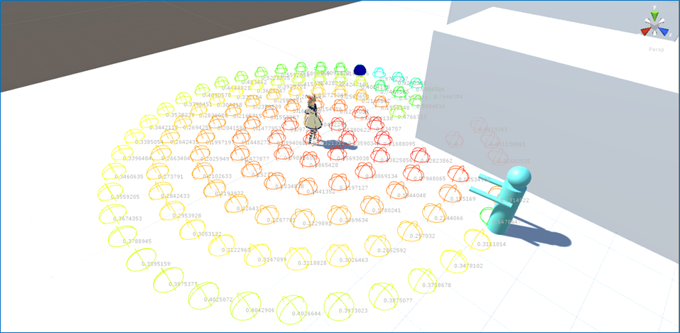

# Simple Onigokko Game using Environment Query for Unity

This is a demo project using [EnvironmentQueryForUnity](https://github.com/sotanmochi/EnvironmentQueryForUnity).

Mixed Reality Game and Tactical Position Analysis / ユニティちゃんと鬼ごっこができるMRゲームと戦術位置解析システム  
https://speakerdeck.com/sotanmochi/mixed-reality-game-and-tactical-position-analysis

[Watch on Youtube](https://youtu.be/AHhcX-tlYNw)

## How to play
You can move player character using arrow keys (up, down, left, right).

## Tested Environment
- Unity 2019.4.17f1
- Windows 10 Pro

## Third party assets
### Unity-Chan model

This asset is provided under the Unity-Chan License 2.0 terms.  
Please refer to the following link for information regarding the Unity-Chan License.  
http://unity-chan.com/contents/guideline_en/

## License
このプロジェクトは、サードパーティのアセットを除き、MIT Licenseでライセンスされています。  
This project is licensed under the MIT License excluding third party assets.